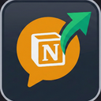

# Notion AI Chat Scraper

Export your [Notion AI](https://www.notion.so/product/ai) chat conversations as Markdown or JSON — including thinking/chain-of-thought, tool calls, and full conversation history.

No other tool captures Notion's built-in AI chat. This fills that gap.



---

## Features

- **Live capture** — intercepts AI responses as they stream in
- **Historical capture** — recovers past conversations when you open them
- **Full fidelity** — thinking/CoT blocks, tool calls, model info, thread titles
- **Export** — Markdown (readable) or JSON (machine-readable)
- **Two delivery methods** — Firefox extension or Tampermonkey userscript

---

## Install

### Option A: Firefox Extension (recommended)

1. Download the latest `.xpi` from [Releases](https://github.com/git-scarrow/notion-ai-scraper/releases)
2. In Firefox: `about:addons` → gear icon ⚙️ → **Install Add-on From File...**
3. Select the `.xpi` — it installs permanently and survives restarts

### Option B: Tampermonkey Userscript

1. Install [Tampermonkey](https://www.tampermonkey.net/) for your browser
2. Install from [Greasy Fork](https://greasyfork.org/en/scripts/567924-notion-ai-chat-scraper) — or open the [userscript](tampermonkey/notion-ai-scraper.user.js) and click **Raw**
3. Tampermonkey will prompt you to install it

> If using both, disable one — they'll double-capture if both are active.

---

## Usage

**Extension:**
1. Navigate to any Notion AI chat page (`notion.so/...?wfv=chat` or open the AI sidebar)
2. Click the extension icon in the toolbar
3. Conversations appear as you open chats — click **Export All → MD** or **JSON**

**Tampermonkey:**
1. Navigate to a Notion AI chat page
2. Click the Tampermonkey icon → use the menu commands:
   - `Export All → Markdown`
   - `Export All → JSON`
   - `Show capture stats`
   - `Clear captured conversations`

**To capture historical chats:** open each chat thread in Notion — the extension captures messages as Notion fetches them. Clear Notion's IndexedDB cache (`F12 → Application → Storage → Clear site data`) to force a fresh fetch of all cached messages.

---

## Output format

### JSON
```json
[
  {
    "id": "thread-abc123",
    "title": "Pre-Flight Controller validation task",
    "model": "avocado-froyo-medium",
    "turns": [
      { "role": "user", "content": "Create a pre-flight checklist page", "timestamp": 1234567890 },
      { "role": "assistant", "content": "I'll create that page now...", "thinking": "The user wants...", "timestamp": 1234567891 }
    ],
    "toolCalls": [
      { "tool": "create_page", "input": { "title": "Pre-Flight Checklist" } }
    ],
    "createdAt": 1234567890
  }
]
```

### Markdown
```markdown
# Notion AI Chat — Pre-Flight Controller validation task (avocado-froyo-medium)
_ID: thread-abc123_

**You**

Create a pre-flight checklist page

---

**Notion AI**

I'll create that page now...
```

---

## How it works

Notion AI uses two private API endpoints:

| Endpoint | Purpose |
|----------|---------|
| `POST /api/v3/runInferenceTranscript` | Live streaming responses (NDJSON) |
| `POST /api/v3/syncRecordValuesSpaceInitial` | Historical thread + message records |

The interceptor patches `window.fetch` in the page's main JavaScript context (before Notion's [SES lockdown](https://github.com/endojs/endo/tree/master/packages/ses) runs) to observe both endpoints.

- **Extension:** uses `"world": "MAIN"` in the manifest; a bridge script relays data to the background service worker via `postMessage`
- **Tampermonkey:** uses `@grant unsafeWindow` to patch the real page fetch directly

See [docs/ARCHITECTURE.md](docs/ARCHITECTURE.md) for protocol details.

---

## Building / signing

```bash
# Lint
npx web-ext lint

# Sign for self-distribution (requires AMO API key)
npx web-ext sign --api-key=YOUR_KEY --api-secret=YOUR_SECRET --channel=unlisted
```

---

## Known limitations

- `‣` page mentions in **assistant** text can't be resolved — Notion streams them as bare Unicode characters with no metadata. User message mentions are resolved to `[page:id]` / `[user:id]` / `[agent:id]`.
- Messages already in Notion's local OPFS/SQLite cache won't transit the network — clear site data to force a re-fetch.

---

## Credits

See [CREDITS.md](CREDITS.md).

## License

MIT
